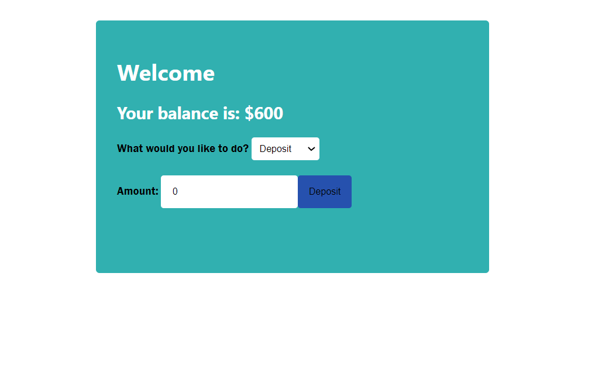

# ATM Machine

## Description

This is a small React app simulating an ATM machine interface.

Deposit or withdraw money and see your account balance update.

## How to Run

Check it out on a <a href='https://codesandbox.io/s/github/waleedalrawi/atm'>sandbox here!</a>

To run locally, download the repository, navigate to it in terminal, and run

### <code> http-server </code>

then navigate to local host in your browser, and open standalone.html

## License

MIT license - see license file.
